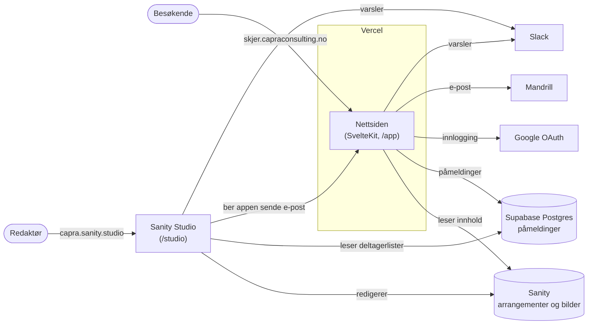

# Skjer

<!-- Redploy -->

En løsning for administrasjon og visning av både interne og eksterne arrangementer hos Capra og Liflig.
Dette inkluderer fagsirkler, konferanser, frokostseminarer og sosiale begivenheter.

UI med [Svelte](https://svelte.dev) og [React](https://react.dev)\
Server side rendering med [SvelteKit](https://kit.svelte.dev)\
Styling med [Tailwind](https://tailwindcss.com)\
Hosted hos [Vercel](https://vercel.com/)\
Innhold og bilder i [Sanity](https://www.sanity.io)

**Nyttige lenker**

[Kanban board i Notion](https://www.notion.so/capra/bc8fb2179c96417f9277b68124793f0e?v=e3a8a020427c4548b3c4628958d10817)

[Figma design](https://www.figma.com/design/ZFgYAb0tYd8LUwKMomOfBx/Nettsideting?node-id=1-664)

**Verktøy**

- [Node.js](https://nodejs.org) (se .node-version)
- [PNPM](https://pnpm.io/installation) (9.0.6 eller senere)
- [Sanity CLI](https://www.sanity.io/docs/getting-started-with-sanity-cli) (anbefalt)
- [Supabase CLI](https://supabase.com/docs/guides/cli/getting-started) (anbefalt)
- [Vercel CLI](https://vercel.com/docs/cli) (valgfritt)

## Komme i gang

For å kjøre koden lokalt:

1. Lag miljøfilene for lokal utvikling ved å kopiere malene:

   ```bash
   cp app/.env.example app/.env.local
   cp studio/.env.example studio/.env.local
   ```

   Fyll inn verdiene for **lokalt/dev** fra teamets passordhvelv. Hva hver variabel er og hvor den kommer fra, står i [Miljøvariabler for appen](#miljøvariabler-for-appen-app) og [Miljøvariabler for Studio](#miljøvariabler-for-studio-studio). Lokalt skal du alltid bruke Sanity-datasettet `test` og dev-prosjektet i Supabase, aldri produksjon.

   ⚠️ Repoet er **offentlig**. Legg aldri ekte verdier i `.env.example`. Filen `.env.local` er ignorert av git.

Hvis du trenger tilgang til Sanity, Google Cloud, Vercel, Mandrill eller Supabase, se [Kontoer og tilgang](#kontoer-og-tilgang).

2. Installer dependencies:

```bash
cd app && pnpm install
cd ..
cd studio && pnpm install
```

3.  Start dev serverene:

```bash
cd app && pnpm dev
cd studio && pnpm dev
```

- SvelteKit applikasjonen skal nå kjøre på [http://localhost:5173](http://localhost:5173/)
- Sanity Studio skal kjøre på [http://localhost:3333](http://localhost:3333)

## Infrastruktur og drift

Denne seksjonen er skrevet for deg som aldri har sett oppsettet før, og som må forstå det fordi noe har sluttet å virke. Den beskriver hvilke tjenester Skjer består av, hvor hver hemmelighet kommer fra, hvordan man lager en ny, og hva man ser etter når noe feiler.

### Oversikt

Skjer består av to applikasjoner i dette repoet og en håndfull eksterne tjenester:



| Del                              | Hvor den kjører                                           | Detaljer                                                                                      |
| -------------------------------- |-----------------------------------------------------------|-----------------------------------------------------------------------------------------------|
| Nettsiden (`/app`)               | Vercel, team **`capra-consulting`**, prosjekt **`skjer`** | https://skjer.capraconsulting.no. Root Directory i Vercel er `app/`.                          |
| Redigeringsverktøyet (`/studio`) | Sanity sin hosting                                        | https://capra.sanity.studio. Deployes av GitHub Actions.                                      |
| Innhold (arrangementer, bilder)  | Sanity, prosjekt **`mnio2ivb`**                           | To datasett: `production` (ekte) og `test` (lokalt og preview).                               |
| Påmeldinger og deltagere         | Supabase                                                  |                                                                                               |
| Innlogging for ansatte           | Google OAuth-klient i Google Cloud                        | Bare e-poster som slutter på domenene i `app/src/models/allowedDomains.model.ts` slipper inn. |
| E-post                           | Mandrill (Mailchimp Transactional)                        | Sendes fra `no-reply@capragruppen.no`.                                                        |
| Slack-varsler                    | Slack-appen «Skjer» (Incoming Webhooks)                   |                                                                                               |
| DNS                              | Lever hos Domeneshop                                      | Bare subdomenet `skjer` peker til Vercel.                                                     |
| Kode og CI                       | GitHub `capraconsulting/skjer`                            | Repoet er **offentlig**.                                                                      |

### Kontoer og tilgang

- **Alle tjenestekontoer eies av en felles bedriftsbruker**, ikke av en enkeltperson: Vercel, Sanity, Supabase, Google Cloud, Mandrill og Slack-appen. Innloggingen ligger i teamets passordhvelv.
- **Passordhvelvet er hovedkopien av alle hemmeligheter.** Vercel viser dem ikke igjen etter at de er lagret (se [Hvor hemmelighetene ligger](#hvor-hemmelighetene-ligger)), så hvis en verdi ikke står i hvelvet, må den lages på nytt.
- Tilgang får du ved å spørre noen som har tilgang til fellesbrukeren

### Miljøer

|                    | Lokalt                              | Preview (pull requests)                                  | Produksjon                         |
| ------------------ | ----------------------------------- | -------------------------------------------------------- |------------------------------------|
| Adresse            | `http://localhost:5173`             | `https://skjer-git-<branch>-capra-consulting.vercel.app` | `https://skjer.capraconsulting.no` |
| Miljøvariabler fra | `app/.env.local`                    | Vercel, miljøet «Preview»                                | Vercel, miljøet «Production»       |
| Sanity-datasett    | `test`                              | `test`                                                   | `production`                       |
| Supabase           | dev-prosjektet                      | dev-prosjektet                                           | prod-prosjektet                    |
| E-post             | av (`ENABLE_EMAIL_SENDING="false"`) | **av**, og Mandrill-nøkkelen er en dummy                 | på                                 |
| Cron-jobber        | kjører ikke (kan kalles manuelt)    | kjører ikke                                              | kjører                             |
| Google-innlogging  | virker                              | **virker ikke** (se under)                               | virker                             |

**Hvorfor virker ikke innlogging i preview?** Google krever at hver tilbake-adresse (redirect URI) registreres nøyaktig, uten asterisk, og preview-adressene er forskjellige for hver branch. Test innlogging lokalt i stedet, eller lag en PR som gjør dette mulig :-)

Preview-adressene er beskyttet med Vercels egen innlogging, så bare medlemmer av Vercel-teamet kan åpne dem.

### Hvor hemmelighetene ligger

| Sted                                                         | Hva                                            | Kan leses tilbake?  |
| ------------------------------------------------------------ |------------------------------------------------|---------------------|
| Passordhvelvet                                               | 1Password                                      | Ja                  |
| Vercel → prosjekt `skjer` → Settings → Environment Variables | Appens variabler for Production og Preview.    | Nei                 |
| GitHub → Settings → Environments → **«Sanity Production»**   | Studioets produksjonsverdier og deploy-tokenet | Nei                 |
| `app/.env.local`, `studio/.env.local`                        | Dine lokale verdier                            | Ja, ignorert av git |

### Miljøvariabler for appen (`/app`)

Alle variabler må finnes i hvert miljø, ellers feiler bygget. Variabler som begynner med `PUBLIC_` er synlige i nettleseren. Verdiene bakes inn **når appen bygges**, så en endring i Vercel krever en ny deploy (Deployments → ⋯ → Redeploy).

| Variabel                                          | Hva den gjør                                                                                                        | Verdi / hvor du lager en ny                                                                                                                                                  | Sensitive                         |
| ------------------------------------------------- |---------------------------------------------------------------------------------------------------------------------|------------------------------------------------------------------------------------------------------------------------------------------------------------------------------|-----------------------------------|
| `PUBLIC_APP_BASE_URL`                             | Sidens egen adresse. Brukes i lenker i e-post, Slack og kalenderfiler.                                              | Prod: `https://skjer.capraconsulting.no`. Lokalt: `http://localhost:5173`.                                                                                                   | nei                               |
| `APP_SECRET`                                      | Signerer avmeldingslenken eksterne deltagere får på e-post. Lenken er gyldig i 2 timer.                             | `openssl rand -hex 32`. Å bytte den ødelegger bare lenker sendt de siste 2 timene.                                                                                           | ja                                |
| `APP_API_TOKEN`                                   | Delt passord mellom Studio og appen. Studio kaller `/api/send-event-updated` og `/api/send-event-canceled` med det. | `openssl rand -hex 32`. **Må være lik** GitHub-secreten `SANITY_STUDIO_APP_API_TOKEN`.                                                                                       | ja                                |
| `CRON_SECRET`                                     | Beskytter cron-endepunktene. Vercel sender den automatisk som `Authorization: Bearer …`.                            | `openssl rand -hex 32`                                                                                                                                                       | ja                                |
| `PUBLIC_CAPRA_BASE_URL`, `PUBLIC_LIFLIG_BASE_URL` | Selskapsnettsidene som får vise `/embed` i en iframe og kalle `/api/public/*` (CORS).                               | `https://www.capraconsulting.no`, `https://www.liflig.no`. Alltid **med `www.`** (det dekker også adressen uten) og **uten `/` til slutt**, for koden sammenligner nøyaktig. | nei                               |
| `PUBLIC_SANITY_PROJECT_ID`                        | Hvilket Sanity-prosjekt                                                                                             | `mnio2ivb` (ikke hemmelig)                                                                                                                                                   | nei                               |
| `PUBLIC_SANITY_DATASET`                           | Hvilket datasett                                                                                                    | `production` i prod, `test` ellers                                                                                                                                           | nei                               |
| `PUBLIC_SANITY_API_VERSION`                       | Låser versjonen av Sanitys API                                                                                      | `2024-03-15`. Ikke endre uten grunn.                                                                                                                                         | nei                               |
| `PUBLIC_SANITY_STUDIO_URL`                        | Studioets adresse: knappen i menyen, forhåndsvisning og CORS                                                        | Prod: `https://capra.sanity.studio`. Lokalt: `http://localhost:3333`.                                                                                                        | nei                               |
| `SANITY_API_READ_TOKEN`                           | Leser innhold, også utkast i forhåndsvisning                                                                        | sanity.io/manage → `mnio2ivb` → API → Tokens → Add API token, rolle **Viewer**                                                                                               | ja                                |
| `SANITY_API_WRITE_TOKEN`                          | Brukes av cron-jobbene (gjentakende arrangementer, påminnelser)                                                     | Samme sted, rolle **Editor**                                                                                                                                                 | ja                                |
| `AUTH_TRUST_HOST`                                 | Lar Auth.js stole på `Host`-headeren bak Vercel                                                                     | `true`. Kreves ettersom Vercel setter Host-headeren på vei inn.                                                                                                              | nei                               |
| `AUTH_SECRET`                                     | Krypterer innloggingscookien (Auth.js). Å bytte den logger ut alle.                                                 | `openssl rand -base64 33`                                                                                                                                                    | ja                                |
| `GOOGLE_CLIENT_ID`                                | Google-innlogging                                                                                                   | Google Cloud → APIs & Services → Credentials → OAuth-klienten                                                                                                                | nei                               |
| `GOOGLE_CLIENT_SECRET`                            | Google-innlogging                                                                                                   | Samme sted. Registrerte redirect URI-er: `https://skjer.capraconsulting.no/auth/callback/google` og `http://localhost:5173/auth/callback/google`.                            | ja                                |
| `SUPABASE_URL`                                    | Supabase-prosjektets API-adresse                                                                                    | `https://<prosjekt-ref>.supabase.co`                                                                                                                                         | nei                               |
| `SUPABASE_KEY`                                    | **anon**-nøkkelen. Den er offentlig av natur, og tilgangsreglene (RLS) i databasen bestemmer hva den får gjøre.     | Supabase → Project Settings → API Keys → «Legacy API keys» → `anon` `public`                                                                                                 | ja (bare så ingen blir forvirret) |
| `SUPABASE_CONNECTION_STRING`                      | Direkte Postgres-tilkobling. Brukes ved påmelding og av jobben for gjentakende arrangementer.                       | Supabase → **Connect** → **Session pooler**. Se [Supabase-tilkoblingen](#supabase-tilkoblingen).                                                                             | ja              |
| `SMTP_HOST`                                       | Mandrills e-postserver                                                                                              | `smtp.mandrillapp.com`                                                                                                                                                       | nei                               |
| `SMTP_AUTH_USER`                                  | Brukernavn hos Mandrill.                                                                                            |                                                                                                                                                                              | nei                               |
| `SMTP_AUTH_KEY`                                   | Mandrill API-nøkkel (`md-…`), brukt som SMTP-passord                                                                | mandrillapp.com → Settings → SMTP & API Info → New API Key                                                                                                                   | ja                                |
| `SLACK_HOOK`                                      | Webhook for cron-jobbenes Slack-meldinger                                                                           | Slack-appen «Skjer» → Incoming Webhooks                                                                                                                                      | ja                                |
| `ENABLE_EMAIL_SENDING`                            | Skrur e-postutsending av og på                                                                                      | `true` i prod, `false` ellers.                                                                                                                                               | nei                               |

#### Supabase-tilkoblingen

Supabase tilbyr tre slags tilkoblingsadresser, og bare én virker for oss:

- **Direct connection** (`db.<ref>.supabase.co`) bruker bare IPv6. Vercel og de fleste nettverk når den ikke, og feilen blir `ENOTFOUND`.
- **Transaction pooler** (port 6543) støtter ikke «prepared statements», som Postgres-klienten vår bruker.
- **Session pooler** ✅. Formatet er `postgresql://postgres.<prosjekt-ref>:<passord>@aws-0-eu-central-1.pooler.supabase.com:5432/postgres`.

Passordet kan ikke leses i Supabase, bare nullstilles: prosjektet → **Database** (i venstremenyen) → **Settings** → Reset database password. Bruk bare bokstaver og tall, ellers må passordet URL-kodes. Et nytt passord bruker omtrent ett minutt før pooleren godtar det. **MERK: Å resette passordet knekker all live trafikk helt til du har fått rullet ut ny connection string til appen**

### Miljøvariabler for Studio (`/studio`)

Studio-variabler (`SANITY_STUDIO_*`) bakes inn i JavaScript-koden som kjører i redaktørens **nettleser**. Legg derfor aldri noe inn der som ikke tåler å bli sett. Lokalt ligger de i `studio/.env.local`. Produksjonsverdiene er secrets i GitHub-miljøet **«Sanity Production»**.

| Variabel                              | Hva                                                               | Lokalt                  | Produksjon                                                            |
| ------------------------------------- |-------------------------------------------------------------------| ----------------------- |-----------------------------------------------------------------------|
| `SANITY_STUDIO_PROJECT_ID`            | Sanity-prosjekt                                                   | `mnio2ivb`              | `mnio2ivb`                                                            |
| `SANITY_STUDIO_DATASET`               | Datasett redaktørene jobber i                                     | `test`                  | `production`                                                          |
| `SANITY_STUDIO_PREVIEW_URL`           | Appen som vises i forhåndsvisningsfanen                           | `http://localhost:5173` | `https://skjer.capraconsulting.no`                                    |
| `SANITY_STUDIO_APP_BASE_URL`          | Appen Studio ber om å sende e-post                                | `http://localhost:5173` | `https://skjer.capraconsulting.no`                                    |
| `SANITY_STUDIO_APP_API_TOKEN`         | Må være lik appens `APP_API_TOKEN` i samme miljø                  | appens lokale verdi     | appens prod-verdi                                                     |
| `SANITY_STUDIO_SUPABASE_URL` / `_KEY` | URL til Supabase-prosjektet, og anon-nøkkelen (samme som i appen) | dev-prosjektet          | prod-prosjektet                                                       |
| `SANITY_STUDIO_SLACK_HOOK`            | Slack-melding når et nytt arrangement publiseres                  | kan stå tom             | Slack-appen Skjer                                                     |
| `SANITY_AUTH_TOKEN` (bare GitHub)     | Lar GitHub Actions deploye Studio                                 | –                       | sanity.io/manage → API → Tokens, rolle **Deploy Studio (Token only)** |

Når Studio kjører med `pnpm dev`, sender det **aldri** e-post eller Slack-meldinger (`process.env.MODE === "development"`). Slack-meldingen sendes dessuten bare første gang et **nytt** arrangement publiseres.

### Deploy

**Appen** deployes av Vercels Git-integrasjon: GitHub-appen «Vercel» er installert på organisasjonen `capraconsulting`, med tilgang bare til `skjer`.

- Push til `main` gir en ny produksjonsversjon.
- Push til en annen branch eller en pull request gir en preview, og sjekken «Vercel – skjer» dukker opp på PR-en.
- Git Fork Protection er på, så pull requests fra forks bygges ikke før noen i teamet godkjenner dem. Det er viktig fordi repoet er offentlig.
- Kode i en PR kjører med Preview-variablene under bygget. Legg derfor aldri produksjonshemmeligheter i Preview.

**Studio** deployes av GitHub Actions (`.github/workflows/sanity-deploy.yml`) ved push til `main` som endrer noe under `studio/`. Resultatet ser du under Actions → «Sanity Deploy Workflow».

### Cron-jobber

Jobbene er definert i `app/vercel.json` og kjører **bare på produksjonsdeployen**. Vercel sender `CRON_SECRET` med automatisk.

| Jobb                                   | Tid (UTC) | Hva den gjør                                                                               | Trenger                                        |
| -------------------------------------- | --------- | ------------------------------------------------------------------------------------------ | ---------------------------------------------- |
| `/api/daily-event-cleaner`             | 01:00     | Sletter påmeldingsdata i Supabase for arrangementer som sluttet for mer enn 30 dager siden | Sanity lesetoken, Supabase anon                |
| `/api/daily-recurring-event-scheduler` | 06:30     | Flytter gjentakende arrangementer til neste gang og melder fra i Slack                     | Sanity skrivetoken, Postgres-tilkobling, Slack |
| `/api/daily-deadline-reminder`         | 07:00     | Slack-oversikt over påmeldingsfrister som går ut i dag                                     | Sanity skrivetoken, Slack                      |
| `/api/daily-event-reminder`            | 07:05     | E-post til påmeldte for arrangementer som starter i morgen                                 | Sanity skrivetoken, Supabase anon, Mandrill    |

- **Skru av alle jobber:** Vercel → prosjektet → Settings → Cron Jobs → Disable. Det virker umiddelbart, uten ny deploy.
- **Se hva som skjedde:** Vercel → Logs, filtrer på `/api/daily-`. Hver jobb svarer med en status (påminnelsesjobben oppgir for eksempel `participantsReminded`).
- Ingenting lagrer at en påminnelse er sendt. **Kjører to deployments de samme jobbene, får deltagerne alt to ganger.**

### Domene og DNS

DNS for `capraconsulting.no` ligger hos **Domeneshop** (navnetjenere `ns1/ns2/ns3.hyp.net`). Det eneste Skjer bruker der, er én post:

```
skjer.capraconsulting.no.  CNAME  cname.vercel-dns.com.
```

- **Flytte domenet til et annet Vercel-team:** CNAME-posten skal _ikke_ endres. Legg domenet til i det nye prosjektet (Settings → Domains). Hvis et annet team bruker det, ber Vercel om en TXT-post (`_vercel…`) som legges inn hos Domeneshop. Når den er verifisert, flytter Vercel domenet automatisk og lager et nytt TLS-sertifikat.
- **Flytte til noe annet enn Vercel:** senk TTL på CNAME-posten først, vent til den gamle TTL-en har gått ut, og bytt så verdien.

### Feilsøking

| Symptom                                                                  | Sannsynlig årsak                                                                                                             |
| ------------------------------------------------------------------------ | ---------------------------------------------------------------------------------------------------------------------------- |
| Arrangementssider viser «500 Internal Error», men forsiden virker        | Sanity-tokenet er ugyldig. Forsiden bruker ikke token, men arrangementssidene gjør det.                                      |
| Påmelding feiler med en feilmelding                                      | `SUPABASE_CONNECTION_STRING` er feil: feil passord, eller Direct connection i stedet for Session pooler                      |
| Påmeldingen lagres, men brukeren får beskjed om at e-post ikke ble sendt | `SMTP_AUTH_KEY` er ugyldig, eller Mandrill har problemer                                                                     |
| Ingen e-post i det hele tatt                                             | `ENABLE_EMAIL_SENDING` er `false`                                                                                            |
| Deltagere får to påminnelser                                             | To deployments kjører cron-jobbene                                                                                           |
| Endret en variabel i Vercel, men ingenting skjer                         | Appen er ikke deployet på nytt                                                                                               |
| Preview-bygget feiler etter ca. 35 sekunder                              | En variabel mangler i Vercel-miljøet «Preview»                                                                               |
| Innlogging feiler                                                        | Redirect URI-en mangler i Google Cloud, feil `GOOGLE_CLIENT_SECRET`, eller e-postdomenet er ikke i `allowedDomains.model.ts` |
| Studio-deploy i GitHub Actions feiler med autentiseringsfeil             | `SANITY_AUTH_TOKEN` i «Sanity Production» er slettet eller ugyldig                                                           |
| Studio sender ikke Slack-melding lokalt                                  | Det er med vilje, se [Miljøvariabler for Studio](#miljøvariabler-for-studio-studio)                                          |

### Bytte en hemmelighet

Rekkefølgen er den samme for alt, så ingenting slutter å virke underveis:

1. **Lag den nye** verdien.
2. **Lagre den** i passordhvelvet, Vercel og/eller GitHub.
3. **Deploy på nytt**, både appen og eventuelt Studio.
4. **Sjekk** at det virker.
5. **Slett den gamle** først nå.

Det du må vite for hver tjeneste:

- **Sanity-tokens:** Du kan ha mange tokens samtidig. Hvis du sletter lesetokenet før appen har fått et nytt, slutter arrangementssidene å virke med én gang.
- **Google:** Bruk «Add secret» på den eksisterende OAuth-klienten. Den gamle og den nye virker samtidig til du deaktiverer den gamle.
- **Mandrill:** Du kan ha flere API-nøkler samtidig.
- **Supabase-passordet:** Det finnes bare ett. Så snart du nullstiller det, feiler påmeldinger til appen har fått det nye og er deployet på nytt.
- **`APP_API_TOKEN`:** Oppdater Vercel og GitHub-secreten `SANITY_STUDIO_APP_API_TOKEN` samtidig, og deploy både appen og Studio.
- **Slack:** Lag en ny webhook i Slack-appen «Skjer», og fjern den gamle ETTER å ha oppdatert verdien i Vercel/Github.

## Sanity

Vi har to dataset i Sanity studio, en for dev testing og en for produksjon.

### Bygg

For å bygge en produksjonsversjon av Sanity studio lokalt, naviger deg til /studio og kjør følgende kommando:

```bash
cd studio && pnpm build
```

Bygg bør alltid kjøres som en del av vår pull request policy 👷

### Deploy

Sanity Studio blir deployet til [https://capra.sanity.studio](https://capra.sanity.studio).
GitHub Actions deploy kjører automatisk ved push til main-branch og ved endringer i /studio mappen. Ikke deploy manuelt fra egen maskin, se [Deploy](#deploy).

Administrering av Sanity instansen kan gjøres via [https://www.sanity.io/manage/personal/project/mnio2ivb](https://www.sanity.io/manage/personal/project/mnio2ivb).

### TypeScript Generering

For å generere typer av innholdsskjemaer, kjør følgende kommandoer fra /studio:

```sh
sanity schema extract --path=./schema.json --enforce-required-fields
sanity typegen generate
```

NB: Når sanity.model.ts er generert i /studio/models, skal den også kopieres til /app.

### Arrangementstekst og bilder

Feltet "Detaljert info om arrangementet" i Sanity støtter nå både tekst og bilder. Dette gjelder kun arrangementsbeskrivelsen, ikke e-postmalene.

## SvelteKit

### Bygg

For å bygge en produksjonsversjon av SvelteKit lokalt, naviger til /app og kjør følgende kommando:

```bash
pnpm build
```

Bygg bør alltid kjøres som en del av vår pull request policy 👷

### Deploy

SvelteKit deployes automatisk av Vercel: push til `main` går til [https://skjer.capraconsulting.no](https://skjer.capraconsulting.no), og pull requests får en egen preview. Se [Deploy](#deploy).

## Supabase

Postgres-databasen kan konfigures fra [https://supabase.com/dashboard/project/<project-id>](https://supabase.com/dashboard/project/<project-id>). Vi har to prosjekter i Supabase dashboardet, en for dev testing og en for produksjon.

### TypeScript Generering

For å generere typer fra databasemodellen, kjør følgende kommando fra enten /studio eller /app:

```sh
supabase gen types typescript --project-id <project-id> database.model.ts
```

NB: Når database.model.ts er generert, må den legges til i både /studio og /app.

## Testing

Vi bruker Playwright for e2e-testing i Sveltekit-appen. Disse ligger under app/src/lib/e2e.

For å kjøre alle testene:

```bash
pnpm playwright test
```

Vil du kjøre kun en enkelt test, sleng på filnavnet på slutten:

```bash
pnpm playwright test example.spec.ts
```

Vil du klikke deg rundt i browser for å se hva som skjer i testene, sleng på `--ui` på slutten 🚀 Vi trenger flere tester 👷!

## Slack

Når et arrangement publiseres for første gang, vil det automatisk genereres en Slack-melding til kanalen #skjer. For å bygge meldingen kan man benytte [Block Kit Builder](https://app.slack.com/block-kit-builder). Denne tjenesten lar deg visuelt designe layouten av meldingen med ulike blokker som knapper, tekstfelter og bilder.

## E-posthåndtering

E-post med kalenderinvitasjon (.ics-fil) sendes fra SvelteKit på serversiden. På grunn av manglende tilgang til en server fra Sanity, har vi satt opp et API-endepunkt i SvelteKit som Sanity kan kommunisere med for å sende e-post. Som SMTP host benytter vi oss av [Mandrill](https://mandrillapp.com/). Autentisering skjer via Mailchimp.

I tillegg finnes det en daglig CRON-jobb for påminnelser om arrangementer dagen før de starter. Denne sender en enkel påminnelses e-post til påmeldte deltagere uten kalenderinvitasjon.

### Testing av E-post Lokalt

For å teste e-postfunksjonaliteten lokalt:

1. For å teste e-post sendt fra app: Legg til 'ENABLE_EMAIL_SENDING = "true"' i app/.env.local.
2. For å teste e-post sendt fra Sanity: Legg til `http://localhost:3333` i `Access-Control-Allow-Origin`.
3. For å teste reminder-jobben lokalt, kall `/api/daily-event-reminder

### Kalenderinvitasjon

Vi kan kun oppdatere kalenderinvitasjoner som allerede er sendt ut. Vi har ikke toveis kommunikasjon gjennom kalenderinvitasjonene, og kan derfor ikke se endringer hvis en deltager svarer Ja, Kanskje eller Nei.

---

## Sanity Arbeidsflyt

### Publisering

1. Gå inn i Sanity Studio og legg først til et nytt arrangement, og trykk "Publiser".
2. Når et arrangement publiseres, blir det automatisk opprettet et arrangement i Suppabase.
3. Besøk SvelteKit appen, eventuelt refresh siden, og se at innholdet vises.

Hvis tid eller lokasjon for et publisert arrangement endres i Sanity, følges denne prosessen:

1. En dialogboks for å bekrefte endringen vises.
2. En e-post sendes til alle påmeldte deltagere for å informere om ny tid/lokasjon.
3. Den eksisterende kalenderinvitasjonen oppdateres med de nye detaljene, slik at deltagerne har oppdatert informasjon i kalenderen.
4. Innhodet blir publisert på nytt.

### Avpublisering

1. Gå inn i Sanity Studio og trykk "Avpubliser" på et publisert arrangement.
2. Arrangement blir avpublisert og vises ikke i SvelteKit-appen.

Innholdet kan republiseres uten noen konsekvenser.

### Sletting

1. Gå inn i Sanity Studio og trykk "Slett".
2. En dialogboks for å bekrefte slettingen vises.
3. Arrangementinformasjon lagret i Sanity og Supabase dataen blir permanent slettet.

### Avlysning

1. Gå inn i Sanity Studio og trykk "Avlys arrangement".
2. En dialogboks for å bekrefte avlysningen vises.
3. En e-post sendes ut til alle påmeldte deltagere for å informere om avlysningen.
4. Kalenderinvitasjonen markeres som avlyst i deltagerens kalender.
5. Arrangementet blir avpublisert i Sanity og innholdet blir "Read only".

Innholdet kan ikke republiseres på nytt, men kan dupliseres for nytt bruk.

### Opprydding av Arrangementer

For å oppfylle GDPR-krav og spare lagringsplass, slettes arrangementer og tilhørende data fra Supabase som ble avsluttet for mer enn 30 dager siden. Dette håndteres av CRON-jobben "daily-event-cleaner". Innholdet forblir lagret i Sanity.

### Gjentakende Arrangementer

Gjentakende arrangementer håndteres av CRON-jobben "daily-recurring-event-scheduler". Når et gjentakende arrangement er ferdig, utfører jobben følgende:

1. Fjerner det gamle arrangementet og tilhørende data fra Supabase
2. Oppdaterer arrangementet med nye tider og publiserer det i Sanity
3. Oppretter et nytt arrangement i Supabase
4. Sender ut en varsling gjennom Slack

### Påminnelse før arrangement

CRON-jobben "daily-event-reminder" kjører daglig og sender påminnelse til deltagere for arrangementer som starter neste dag.

1. Jobben finner fremtidige arrangementer som matcher reminder-innstillingen på arrangementet.
2. Standardoppførsel er på for arrangementer åpne for eksterne, og av for interne arrangementer.
3. Det er mulig å overstyre dette per arrangement i Sanity.
4. Påminnelsen inneholder en enkel e-post med lenke til arrangementsiden for mer informasjon.

## SvelteKit Arbeidsflyt

### Påmelding

Når en bruker melder seg på et arrangement, utløses følgende prosess:

1. En e-postbekreftelse sendes til brukeren.
2. E-posten inkluderer en kalenderinvitasjon med deltagerstatus satt som akseptert.
3. Kalenderinvitasjonen legges automatisk inn i deltagerens kalender, slik at arrangementet blir synlig i kalenderen umiddelbart etter påmelding.

### Avmelding

Avhengig av om deltageren er intern eller ekstern, håndteres avmeldinger på forskjellige måter:

#### Interne deltagere

1. Når en intern deltager melder seg av et arrangement, sendes en bekreftelses e-post som informerer om at avmeldingen er mottatt.
2. Kalenderinvitasjonen oppdateres samtidig til å vise status som avslått.

#### Eksterne deltagere

1. Eksterne deltagere som ønsker å melde seg av, mottar først en e-post med en lenke for å bekrefte avmeldingen.
2. Når mottaker klikker på bekreftelseslenken og den blir godkjent på nettsiden, sendes en ny e-post som bekrefter avmeldingen.
3. Kalenderinvitasjonen oppdateres til å vise status som avslått, på samme måte som for interne deltagere.
